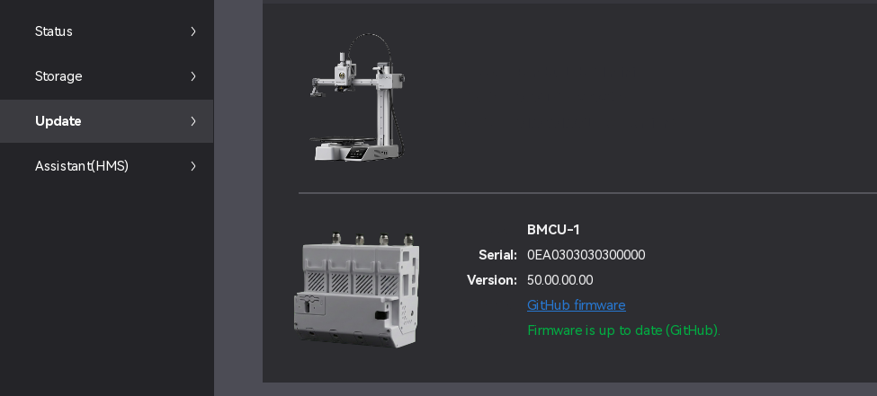

# Bambu Studio (BMCU fun build)

This is a **custom build of Bambu Studio**, made mainly **for fun** and for my own enjoyment 😄  
It adds a **fun / experimental BMCU support**, which I personally really like.

---

## What’s changed?

### 🧩 BMCU support
- Adds a playful / experimental handling of **BMCU**
- Checks BMCU firmware version against **my BMCU firmware repository**
- If you don’t have BMCU - no problem, everything still works normally

### 🚫 Important: HMS error handling
One specific HMS error related to BMCU is **ignored on purpose**:

> **The firmware of AMS does not match the printer. Please upgrade it on the "Firmware" page.**

This error always shows up at printer startup when using BMCU and is basically useless.

Because of that:
- HMS is still **useful**
- Other errors are **not affected**
- No annoying warning on every startup

---

## Can I use this without BMCU?

Yes 👍  
You can use this build **normally even if you don’t have BMCU**.

- No features are removed
- No behavior is broken
- You just get some harmless extra BMCU-related logic

---

## Version

- **Based on latest Bambu Studio**
- **Build date:** **13.01.2026**

---
